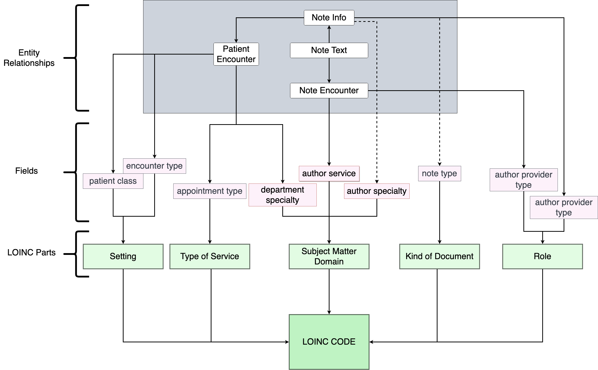

# GPC LOINC Document Ontology Mapping Collaboration Project

## Introduction

This project is designed to help GPC sites efficiently map their clinical documents to LOINC Document Ontology specified
codes. The project is meant to kickstart each site’s efforts and will likely require additional site-specific
information to improve mapping to an acceptable level.

**This repository is meant to be EHR vendor agnostic**

## Background

Important clinical information can most abundantly be found in clinical notes from nurses and doctors. These notes are
rich in useful information for the medical faculty and researchers. However, while doctors can read the individual notes
as they become necessary, the same cannot be done by researchers, who may need to use millions of said notes in their
study; And due to the unstructured nature of these notes, there isn’t a simple program that can extract the relevant
data required by a research topic. Therefore, clinical information extraction is a daunting task for anyone attempting
to parse through the notes en masse.

The existence of unstructured data and the need of critical information out of the unstructured data points to a need
for a data extraction method/pipeline that can be used by researchers or doctors to efficiently sort through the data
and find the subset that would be useful to their case. One way to do this is by categorizing the notes using the
Logical Observation Identifier Names and Codes (LOINC) Document Ontology Standard. The LOINC standard defines five
dimensions for all documents and can give documents a unique Code using a combination of these dimensions:
1. Subject Matter Domain (SMD)
2. Kind of Document (KOD)
3. Type of Service (TOS)
4. Setting
5. Role

Note that a document can have a unique LOINC Code even without properly defining all of its dimensions. This README
describes the process developed to match notes to LOINC Codes in institutes using either Cerner or Epic, and how to
best use the program and improve the final results.

There are two overall steps to this pipeline:
1. Extraction of notes metadata
2. Running the program on extracted metadata to map metadata sets to LOINC codes


## Usage steps
The following steps describe, generally, how to use this program:
<details>
  <summary>
    Acquire tables
  </summary>

  Decide which tables you will use to acquire metadata and gather them into your database. Some institutions may not
  have have their desired tables, whether they contain source data or reference data, available immediately. It is
  important to convert from EHR system codes.
</details>
<details>
  <summary>
    Prepare your tables for querying
  </summary>

  You may need to add table partititions and indexes, or whatever tool available to make querying the collected tables
  relatively efficient. It may be beneficial to join your larger tables first to consolidate your data. Consider adding
  indexes on the columns they are joined against and consider partitioning your larger tables.
</details>
<details>
  <summary>
    Query for your metadata
  </summary>

  Query your data so that you have your metadata in one place. When exporting this data, do not export it such that each
  individual note's metadata is provided. Instead, get each unique group of metadata. This means using the GROUP BY
  statement (if using SQL) with your metadata.
</details>
<details>
  <summary>
    Export metadata as a csv
  </summary>

  After you have acquired your metadata, export it as a csv file to use as input for this script.
</details>
<details>
  <summary>
    Get a copy of this repository
  </summary>

  Clone this repository or download it as a zip file. The location does not as this does not interact with other files
  on your system. This program does not require elevated permissions nor internet access. Everything is done locally.
</details>
<details>
  <summary>
    Modify the config file 
  </summary>

  Modify the config file's parameters to fit your setup. If you have different names for your columns, reflect them
  appropriately in your config file. It is safer to explicitly include which columns to use.

  Be sure to set the ```count``` column, if used, so that it is excluded and doesn't cause errors. Additionally, your exported csv should be placed in the **input** folder.

  Before modifying the synomym file, make an appropriately named synonym file for your site.

  ***The default processes/CPUS to use is set to -1, which uses $1-CPUs$ processes***
  ***If you are missing a config file, the program will create a template if it runs without detecting one***
</details>
<details>
  <summary>
    Run the script
  </summary>

  This project uses a virtual environment to simplify packaging requirements. See this [page on PIP and virtual environments](https://packaging.python.org/en/latest/guides/installing-using-pip-and-virtual-environments) for more details. You will need
  to activate the environment and install packages using the requirements file. These are detailed on the previously
  linked website.

  The command to finally run the script is simply:
  ```bash
  python3 main
  ```

  Program arguments are handled in the config file.
</details>
<details>
  <summary>
    Get output csv
  </summary>

  Once the script has completed, find your output csv file that contains your LOINC mappings. The location of this is determined by the config file. If your **output** folder is left as default, the file will be located within the program's **output** directory. You can now use this to link your documents to LOINC codes or for analysis.
</details>


## Extraction and Staging Metadata

Prior to extracting notes metadata, we recommend the following:
- Add any assumptions and filters for notes to the query, including document types ("Scanned Document" is an example of a document type you may want to ignore for now)
- Remove duplicates and older versions of a notes
- Index and/or partition tables joined against

The following is a visual example of how data sources may map to each LOINC document ontology domain. Notably, some domains have multiple sources to increase domain coverage:


For the examples on gathering the metadata and condensing them further, see the **docs** folder which contains:
- [Metadata_Query_Example.sql](docs/Metadata_Query_Example.sql)
  - For getting notes metadata
- [Metadata_Query_Mapped.sql](docs/Metadata_Query_Mapped.sql)
  - For combining notes metadata into groups, consolidating multiple columns


## Running the Code
### Configs
Configs will be creted, if they do not exist, when the program runs. The program will stop afterwards and the config file must be renamed to ```config.json``` in order to be used.


| CONFIG | DESCRIPTION | DEFAULT | NOTE |
| ----------- | ----------- | -----------| -----------|
| LOGGER_NAME | name for logger and log files | doc_ontology |
| LOGGER_FOLDER | location to write log files | null | /logs |
| INPUT_FOLDER | location to find input files | null | /input |
| OUTPUT_FOLDER | location to find output files | null | /output
| USE_INCLUSIONS | Boolean: Use list of columns to include | |Only use inclusions OR exclusions|
| USE_EXCLUSIONS | Boolean: Use list of columns to include| | Only use inclusions OR exclusions|
| CPUS | Number of CPUS/Processes to use for LOINC mapping | -1 |-1 uses all except 1. Will not use more CPUs than available
| INPUT_FILE | name of file to use as input | | Do not use filepath
| LOINC_SOURCE | name of loinc ontology source file | DocumentOntology_original.csv | This should not need to change. Locatd in /configs
| LOINC_NAMES | name of loinc ontology file to map codes to names | ComponentHierarchyBySystem.csv
| SYNONYMS_FILE | name of file used for synonym matching| synonyms.csv |These are site-specificLocated in /configs
| APPENDED_FILENAME | name to append to output file| LOINC_MAPPINGS |File will go to OUTPUT_FOLDER
| COUNT_COLUMN | name of column containing note counts| Counts |This column is excluded from being added to the bag of words
| EXLUDED_COLUMNS | List of columns to exclude from bag of words| Counts | |
| INCLUDED_COLUMNS | List of columns to exclude from bag of words| | |

## Virtual environment
Dependencies for this should be handled in the venv folder. To activate the virtual environment, run
```
source /venv/vin/activate
```

To run the code, set the correct configs and run from a terminal a command such as:
```
python main.py
```

## Algorithm Implementation
Here is a <a href="/docs/BoWLOINCDocOntologyMapping.pdf" type="application/pdf">PDF</a> that outlines the implementation details as well as the most recent results on Mizzou and MCW side.

## Validation and Synonymy Improvements
The program has now been officially validated at the University of Missouri (MU), Columbia as well as the Medical College of Wisconsin (MCW), Milwaukee. 
We have a validation document designed as a guide to standardize the validation process across all sites as necessary. See the document <a href="/docs/Validation Process - EPIC & Cerner.pdf" type="application/pdf">here</a>.

At MU, we validated 200 rows chosen randomly from among the top 1000 common metadata combinations. These 200 rows covered around 15.2 million notes in total. Of them, 167 were deemed valid, covering around 13.9 million notes. This calculates to **91.6%** of the notes being valid. The precision and recall values were **0.954** and **0.913** respectively, with the **F1 score being 0.933**.

Similarly at MCW, 200 rows were randomly chosen from among the top 1000 common metadata combinations, covering 25 million notes. Validation efforts showed that around 157 rows were valid, covering around **21 million notes**. This means that around **85%** of the notes had a valid mapping.

Future site validation efforts are under consideration as to whether they should be done on-site at individual locations, or by a specialized team at a central location. Testing validation at MCW showed that MU team's validation efforts on the same MCW data were very similar to the Milwaukee team's validations. 

There may be instances where the metadata columns contain enough information to properly map the document to a LOINC Code, but the program was unable to map it. At such times, the synonymy list can be used to improve the mapping. Simply add the word that the program isn't catching into the synonymy list and add a synonym that will be helpful for mapping the original word to a **LOINC keyword.** 

For a list of LOINC keywords, consult the *document_ontology*.csv file that ships with the *LOINC Documentation*.

## UMLS Integration
We attempted to use the UMLS metathesaurus functionality, but we were not able to effectively implement it. This is due to the inconsistent results from the UMLS GET requests. Due to this, we decided to create a local Synonymy list and utilize that instead. Given the power of UMLS, it would be good to reassess the program and a way to attach UMLS into it, which may greatly improve the performance and coverage.  

## Governance
Depending upon the needs of the project, a GPC Research Opportunity Assessment (ROA) and Data Request Oversight Committee (DROC) request will be required prior to receiving deidentified notes.  The ROA process is the initial step for investigators to collaborate with the GPC, and the DROC process is the request for data. Investigators should note the desire for de-identified notes in the DROC request form. After approval from the DROC sites, de-identified notes will be made available to approved investigators from the participating sites. 
